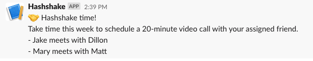

# 🤝 Hashshake


This is an application to foster communication and camaraderie between remote
teammates. It is inspired by:

[RailsConf 2017: Keynote by Justin Searls](https://youtu.be/V4fnzHxHXMI?t=544)

At the beginning of the week, the application randomly chooses pairs of
coworkers to meet up for informal, 20-minute conversation and coffee meetings.
The coworkers link up, arrange the meeting, and talk about whatever they want.
Then next week, we do it again.

### Usage

Add to the environment the names of your teammates, and Slack app endpoint
you've configured per `.env`.

Set up a cron job to run the following task once a week:

```
$ rake notify
```

This will post in Slack like so:



### Deployment

Push to Heroku, application name 'hashshake.'

### Tests

Copy `.env.example` to `.env`, and run:

```
$ rake
```
